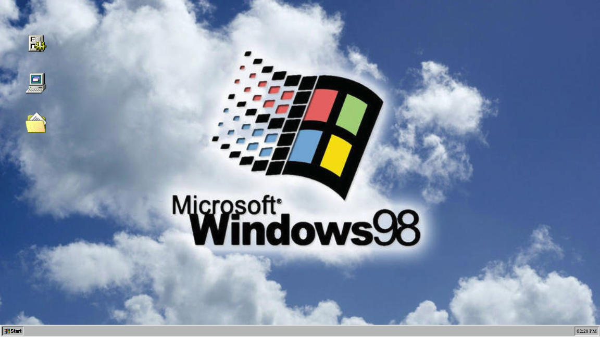

# Windows 98 FakeOS Project

## Project Overview

Built with with HTML, CSS, and JavaScript, this project is a dynamic web application that emulates the Windows 98 operating system, featuring a built-in calculator, a to-do app, and a weather API app. It serves as a comprehensive practical exercise to enhance and solidify foundational web development skills.

## Deployment Link

This Windows 98 fakeOS is deployed. Check it out [here](https://windows98-fake-os.netlify.app/).

## Screenshot

## Table of Contents
- [Goals & MVP](#goals--MVP)
- [Tech Stack](#tech-stack)
- [Build Steps](#build-steps)
- [Design Goals](#design-goals)
- [Project Features](#project-features)
- [Additions & Improvements](#additions--improvements)
- [Learning Highlights](#learning-highlights)
- [Known Issues](#known-issues)
- [Challenges](#challenges)

## Goals & MVP
The goal was to recreate a familiar Windows 98 environment with functional applications like a calculator, weather app, and a to-do list, using clean and modular JavaScript along with SCSS for styling.

## Tech Stack

- HTML
- CSS/SCSS
- JavaScript
- Git
- OpenWeatherMap API

## How To Use
To interact with FakeOS, select an icon on the desktop to open an application. Use the Start menu at the bottom to navigate through available options and features. The applications perform real functions, like fetching live weather data and managing a to-do list.

## Design Goals
- Decisions about project design

## Project Features
- [x] Basic desktop with wallpaper, icons, and modals for apps
- [x] The UI mimics a Windows 98 desktop, with interactive icons and a functional taskbar
- [x] JavaScript modules handle the logic for the calculator, weather data retrieval, and to-do list management.
- [x] A calculator, todo list, and weather application built into the user interface

## Additions & Improvements
- [ ] Addition of Windows 98 modals for a classic look
- [ ] Increased functionality of the start menu
- [ ] Improvements to Desktop Icons
- [ ] Refining the style and function of the apps contained within the project

## Learning Highlights
- This project was an exciting chance to dive deeper into JavaScript. Building the applications like the calculator and the weather tool helped me understand how to structure and execute more complex JavaScript projects. It was particularly fun to tackle real-world problems, like fetching and displaying live data, and seeing my code bring the FakeOS to life was incredibly rewarding.

## Change Logs
List of dates and work provided

## Known Issues
List errors

## Challenges
- List challenges

## Contact Me
- Visit my [LinkedIn](https://www.linkedin.com/in/obj809/) for more details.
- Check out my [GitHub](https://github.com/cyberforge1) for more projects.
- Or send me an email at obj809@gmail.com
 
Thanks for your interest in this project. Feel free to reach out with any thoughts or questions.
 
 
Oliver Jenkins © 2024
