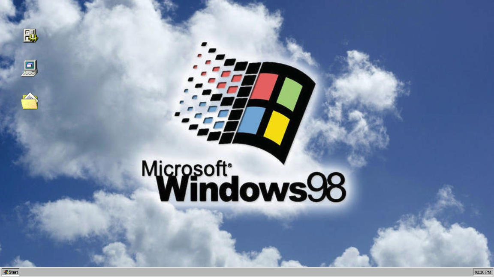

# README for Windows 98 FakeOS Project

## Project Overview

FakeOS is a dynamic web application designed to replicate the aesthetic and functionality of Windows 98, using modern web technologies. The project serves as a practical exercise to solidify foundational skills in HTML, CSS, and JavaScript, focusing on building a non-responsive, single-page application that imitates a desktop operating system environment.

## Deployment Link

This Windows 98 fakeOS is live! Check it out [here](static/desktop-screenshot.png).

## Screenshot

## Table of Contents

- [Tech Stack](#tech-stack)
- [Goals](#goals)
- [How to Use](#how-to-use)
- [Implementation](#implementation)
- [Code / Important Elements / Design Decisions](#code--important-elements--design-decisions)
- [Issues & Bugs](#issues--bugs)
- [Additions & Improvements](#additions--improvements)
- [Learning Highlights](#learning-highlights)

## Tech Stack

- HTML
- CSS/SCSS
- JavaScript
- Git
- OpenWeatherMap API

## Goals

The goal was to recreate a familiar Windows 98 environment with functional applications like a calculator, weather app, and a to-do list, using clean and modular JavaScript along with SCSS for styling.

## How to Use

To interact with FakeOS, select an icon on the desktop to open an application. Use the Start menu at the bottom to navigate through available options and features. The applications perform real functions, like fetching live weather data and managing a to-do list.

## Implementation

- **MVP**: Basic desktop with wallpaper, icons, and modals for apps.
- **User Interface**: The UI mimics a Windows 98 desktop, with interactive icons and a functional taskbar.
- **Logic Strategy**: JavaScript modules handle the logic for the calculator, weather data retrieval, and to-do list management.

## Code / Important Elements / Design Decisions

The project employs a modular JavaScript approach, separating logic from DOM manipulation. Use of SCSS helped in managing complex styling while maintaining the classic Windows 98 look.

## Issues & Bugs

- The to-do app currently adds new entries to the top of the list; an adjustment is needed to reverse this order for a more intuitive user experience.

## Additions & Improvements

- Added Windows 98-style icons and modals.
- Introduced functionality for moving icons around the desktop.
- Enhanced the visual and functional aspects of applications using SCSS.

## Learning Highlights

This project was an exciting chance to dive deeper into JavaScript. Building the applications like the calculator and the weather tool helped me understand how to structure and execute more complex JavaScript projects. It was particularly fun to tackle real-world problems, like fetching and displaying live data, and seeing my code bring the FakeOS to life was incredibly rewarding.

## Contact Me

- Visit my [LinkedIn](https://www.linkedin.com/in/obj809/) for more details.
- Explore my [GitHub](https://github.com/cyberforge1) for additional projects.
- Or email me at obj809@gmail.com
